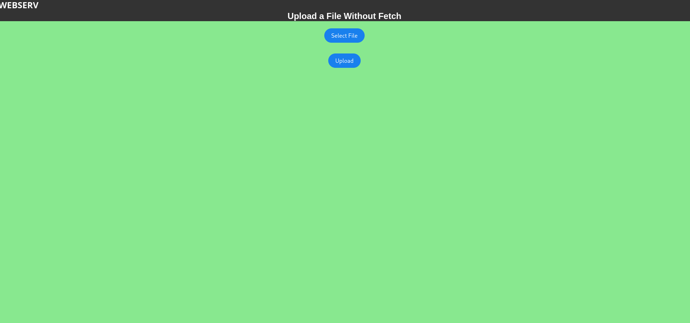

<h1 align="center" id="title">Webserv</h1>

<p id="description">Build a HTTP1.1 web server that serves a fully static website. This was built together with codinggolfer and @Welhox</p>

  
  
<h2>🧐 Features</h2>

Here're some of the project's best features:

*   NGINX based configuration parsing
*   HTTP Request Handling
*   HTTP Response Handling
*   GET POST and DELETE Methods
*   GET and POST with CGI Python script

<h2>🛠️ Installation Steps:</h2>

<p>1. Download</p>

```
git clone the repository in your chosen directory
```

<p>2. Compile</p>

```
Compile the project with Make
```

<p>3. Run</p>

```
./webser config/server.conf
```

<p>4. Test</p>

```
Open your browser and go to the specified ip and port. You can then navigate the website.
```

<h2>🍰 Contribution Guidelines:</h2>

The scope of this project was large and we divided it in three initial parts. I parsed the config file, logger and data structure @codingolfer handled the HTTP Request parsing and @Welhox handled the response. 
We all worked on the server loop and CGI together. The configuration parsing required deep understanding of NGINX's own standards and I based our own on this. 
Each config file requires a minimum of one server to be able run and also a root directory with a default page to serve. 
I had a lot of fun with this as in previous I have used C limited to just the Standard Library so using C++ plus regex made the parsing much cleaner. 
I set the information from the config file to inside a vector containing maps of key value pairs. I then built function make theses accessible to both the response and request parsing in simple way.
The logger was also fun to build, it is called any with either INFO or ERROR, a message, and whether it should be printed to the console. This provided powerful debugging as we could traceback the behaviour of the server
in a clean way and avoid having the deconstruct Valgrind or fsanitise error messages.

There were many challenges in this project the most pressing was the handling of file descriptors and client information through epoll. As all read and write operations go through epoll it required very delicate engineering to ensure everything remained in scope at the right time. Credit to @Welhox for the ingenious Nodes to store server and client information ;)

<h2>Pics:</h2>
<h3>Homepage</h3>

<h3>CGI</h3>

<h3>File upload</h3>


  
<h2>💻 Built with</h2>

Technologies used in the project:

*   C++
*   Python
*   CGI
